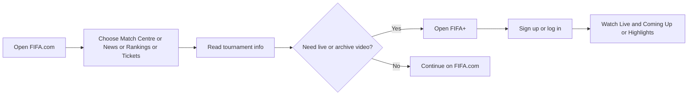
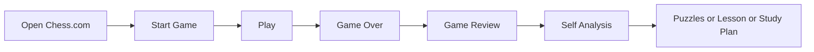

# GroupID-PA1 Product Research: FIFA and Chess.com web experiences

Group ID: GroupID. Members: Le Minh, 21127645, Nguyen Vu Bach, 21127224, Pham Nguyen Gia Bao, 20127119, Trang Minh Nhut, 22127318. Course: HCI. Date: 2026-06-10. Product pair: FIFA.com and Chess.com. Screenshot evidence note: all screen-level claims reference captured or annotated Playwright evidence.

## Executive summary

This report compares FIFA and Chess.com as web experiences with opposite interaction centers. FIFA is primarily browse, compare, and follow: the user moves through official football news, match data, rankings, tickets, and a FIFA+ watch handoff. Chess.com is primarily do, review, and improve: the user starts games, manages speed features, reviews finished games, analyzes positions, solves puzzles, follows lessons, and plans tournaments. Numbered references are used for all product claims.

## Method and evidence protocol

The team observed official website screens through Chromium automation, saved raw screenshots, generated annotated versions and crops with sharp, and recorded captions in assets/figures_manifest.json. Screenshots are used as evidence only when the referenced UI region is visible. Limitations: login-only personalized states were not entered, and any live content visible on access date may change.

| Figure | Product | Evidence role |
| --- | --- | --- |
| F-01 to F-08 | FIFA.com | Captured live pages for home, navigation, Match Centre, search, article, competition, and mobile density |
| F-09 to F-12 | FIFA.com | Flow/map, crop, and proposed improvement figures grounded in the captured evidence |
| C-01 to C-08 | Chess.com | Captured live pages for home, play, board, puzzle, learn, navigation, feedback, and mobile layout |
| C-09 to C-12 | Chess.com | Flow/map, crop, and proposed improvement figures grounded in the captured evidence |

## Product selection rationale

| Product | Domain | Modality | Positioning |
| --- | --- | --- | --- |
| FIFA | Official football portal and watch ecosystem | Browse-first web product for football information, rankings, ticketing, and watch handoff | Browse-first football web ecosystem for official news, match-following, rankings, tournament discovery, ticketing trust, and FIFA+ watch handoff. |
| Chess.com | Online chess play and learning platform | Action-first web product for play, review, analysis, and learning | Action-first chess web platform for games, review, self-analysis, puzzles, lessons, study plans, tournaments, and fair-play-guided competitive play. |

FIFA.com was selected as the official browse-first football portal. Chess.com was selected as an action-first online chess platform. The comparison isolates how sports websites differ when one product centers on official information discovery and the other centers on immediate gameplay and feedback.

## Source method

Official English pages were prioritized. FIFA client-side pages that yielded sparse crawl text were retained as official URLs when screenshots confirmed the screen. Chess.com claims rely on the official homepage, observed Playwright screenshots, and official support pages. Secondary sources were not needed.

| Citation | Product | Type | Claim supported |
| --- | --- | --- | --- |
| [1] | FIFA | Official FIFA news and navigation | Inside FIFA exposes Latest FIFA News and the global navigation labels Match Centre, News, Rankings, Tickets & Hospitality, Play, Inside FIFA, plus sibling destinations such as FIFA+, Store, Collect, and Rewards. |
| [2] | FIFA | Official FIFA topic index | The all stories page supports exploratory browsing through categories, content types, articles, blogs, media releases, videos, and albums. |
| [3] | FIFA | Official FIFA tournament blog | The FIFA World Cup 2026 blog functions as a tournament story hub with dated updates and story cards. |
| [4] | FIFA | Official FIFA media release | FIFA directs fans to FIFA.com/tickets to register interest, create a FIFA ID, and follow phased ticket releases. |
| [5] | FIFA | Official FIFA media release | FIFA.com/tickets is identified as the official and preferred ticket source; fans are asked to check it regularly; the official Resale/Exchange Marketplace is available for eligible ticket holders. |
| [6] | FIFA | Official FIFA+ watch destination | FIFA+ presents a watch surface with sign-in or get-started controls, live or upcoming content, highlights, replays, documentaries, and archive content. The FIFA+ destination is presented through a DAZN-branded page. |
| [7] | FIFA | Official FIFA Match Centre | The Match Centre URL exposes fixtures, results, match details, competitions, and live-now filtering; some content is client-side rendered. |
| [8] | FIFA | Official FIFA rankings page | The rankings page exposes the latest men's ranking table, filters, official update dates, and ranking rules notes. |
| [9] | FIFA | Official FIFA tickets page | The tickets URL is the official entry point for first-hand FIFA tournament ticket and hospitality information; the page is client-side rendered in crawled text. |
| [10] | Chess.com | Official Chess.com homepage | The homepage foregrounds Play, Puzzles, Learn, Train, Watch, Community, Get Started, lessons, bots, puzzles, and watching events. |
| [11] | Chess.com | Official Chess.com help | Users can start games from the homescreen or site-wide Play menu, using recent time control, custom settings, random opponent, bots, or friends. |
| [12] | Chess.com | Official Chess.com help | Premoves can be enabled and then entered while it is the opponent's turn; the feature saves time but executes automatically if legal. |
| [13] | Chess.com | Official Chess.com help | Focus Mode minimizes distractions by expanding the board and showing only the board, clocks, draw, and resign controls. |
| [14] | Chess.com | Official Chess.com help | Board settings, Focus Mode, Theatre Mode, and Flip Board appear when hovering near the board/sidebar boundary, creating a discoverability issue for hidden controls. |
| [15] | Chess.com | Official Chess.com help | Game Review appears after a game and provides a detailed review flow with accuracy, move classifications, key moves, coach guidance, graphs, and retry learning. |
| [16] | Chess.com | Official Chess.com help | Game Analysis lets users revisit analyzed games and continue deeper study through analysis tools. |
| [17] | Chess.com | Official Chess.com help | The Analysis Board supports direct manipulation, setup position, FEN/PGN loading, game history, collections, engine settings, evaluation bar, lines, arrows, and move feedback. |
| [18] | Chess.com | Official Chess.com help | Puzzles are reachable from the side menu or homepage and include puzzle of the day, rated puzzles, themes, Puzzle Rush, and Puzzle Battle. |
| [19] | Chess.com | Official Chess.com help | Lessons are reached from Learn, use interactive practice challenges, and include access limits by membership level. |
| [20] | Chess.com | Official Chess.com article | Study plans guide players by skill level and help organize training time through curated lessons and videos. |
| [21] | Chess.com | Official Chess.com help | Tournament schedules expose arena and prize tournament calendars such as Titled Tuesday, Arena Kings, Bullet Brawls, and variant events. |
| [22] | Chess.com | Official Chess.com fair-play page | The fair-play page explains competitive integrity, account closures, fair-play policy, event checks, and enforcement expectations. |

## Product A: FIFA.com

FIFA.com is the official football web portal for sports news, match information, tournament discovery, rankings, official media, tickets, and FIFA+ handoff when relevant.

### FIFA user groups

Casual fans, tournament followers, and media/student researchers need official football information under different time pressure and credibility requirements.

## Product B: Chess.com

Chess.com is an online chess platform for playing games, solving puzzles, learning lessons, reviewing games, reading chess content, and improving chess skill.

### Chess.com user groups

Beginner learners, competitive online players, and returning casual players need fast play, visible feedback, and progressive learning paths.

## Personas

| ID | Persona | Age range | Tech experience | Domain experience | Main goal | Frustration | Device | Environment | Usage frequency | Constraint |
| --- | --- | --- | --- | --- | --- | --- | --- | --- | --- | --- |
| F-P1 | Casual football fan | 18-25 | Medium | Low-medium | Check today's fixtures, live scores, results, and short news quickly | Slow paths to match information | Mobile phone | Public transport or short break | Several times per week | Interrupted attention and low patience |
| F-P2 | Tournament follower | 24-40 | High | Medium-high | Follow tournament pages, teams, fixtures, standings, and media | Too many tournament links to compare | Desktop | Home or office | Weekly during tournaments | Needs scannable date/team comparison |
| F-P3 | Media or student researcher | 20-35 | High | Medium | Find official football news, tournament history, team info, and reliable sources | Unclear source path across FIFA properties | Laptop | Focused research session | Monthly or project-based | Needs credible source trails |
| C-P1 | Beginner chess learner | 13-22 | Medium | Low | Start a simple game, learn rules, solve easy puzzles | Feature overload before knowing chess terms | Mobile or laptop | Home or school | Several times per week | Low domain knowledge and needs guidance |
| C-P2 | Competitive online player | 18-35 | High | High | Start a rated game quickly and monitor clock, moves, rating, opponent status | Delay or mis-tap under time pressure | Desktop | Focused play setup | Daily | Motor accuracy and low delay tolerance |
| C-P3 | Returning casual player | 25-45 | Medium-high | Medium | Play a daily or quick game, read content, review mistakes | Forgets feature locations and analysis meanings | Mobile browser | Interrupted home use | Weekly | Needs recognition and lightweight feedback |

### FIFA personas

| ID | Name | Age | Tech proficiency | Goal | Context |
| --- | --- | --- | --- | --- | --- |
| F-P1 | Lan Tran | 20 | Medium | Check scores, fixtures, and one key tournament story between classes | Student on campus laptop, short time window, noisy environment, intermittent attention |
| F-P2 | Ethan Nguyen | 27 | High | Follow official tournament news and rankings during office breaks | Desktop at work, multiple tabs open, daylight glare, short sessions, high scan pressure |
| F-P3 | Maria Pham | 31 | Medium | Verify official ticket source, resale status, and then watch highlights on FIFA+ | Evening home browsing on laptop, compares tabs, trust-sensitive, family trip planning |

### Chess.com personas

| ID | Name | Age | Tech proficiency | Goal | Context |
| --- | --- | --- | --- | --- | --- |
| C-P1 | Minh Bui | 18 | Medium | Learn chess basics through lessons, puzzles, and a study plan | Student on shared laptop, beginner mental model, low confidence, needs guidance |
| C-P2 | Alex Hoang | 24 | High | Start blitz games fast, use premoves, reduce distractions, keep momentum | External keyboard and mouse, noisy dorm room, many short sessions, time pressure |
| C-P3 | Quynh Le | 29 | High | Review finished games, run self-analysis, and plan tournament play | Quiet desktop setup, longer study sessions, strong interest in accuracy and improvement |

## Use cases

| ID | Title | Product | Persona | Device | Posture | Attention | Distraction | Normal flow | Alternate flow | Error path | Figures | HCI concepts |
| --- | --- | --- | --- | --- | --- | --- | --- | --- | --- | --- | --- | --- |
| F-UC1 | Find today's match schedule | FIFA.com | F-P1 | Mobile | One-handed glance | Low | Public transport | Open FIFA.com, select Match Centre, scan date/live rows | No live match; switch to results | Slow client render; retry/refresh | F-04, F-08 | information scent, visibility of status |
| F-UC2 | Check live score or result | FIFA.com | F-P1 | Mobile/desktop | Short break | Low | Noisy place | Use Match Centre and live toggle | Sort/filter by competition | Too many entries; search competition | F-04 | mental model, cognitive load |
| F-UC3 | Read football news article | FIFA.com | F-P2 | Desktop/mobile | Leaning back | Medium | Office | Open News or article URL, scan headline/body | Use related links | Reading interrupted by dense media | F-06 | visual attention, reading load |
| F-UC4 | Find tournament information | FIFA.com | F-P2 | Desktop | Focused comparison | Medium | Home/office | Open tournament page, scan dates/teams/content | Use navigation/footer | Wrong FIFA property reached | F-07, F-10 | information architecture, consistency |
| F-UC5 | Search team/player/article/tournament | FIFA.com | F-P3 | Laptop | Focused lookup | High | Research session | Open search, enter query, compare result categories | Use navigation if search fails | Sparse or mixed results | F-05 | recognition, error recovery |
| C-UC1 | Start quick online chess game | Chess.com | C-P2 | Desktop/mobile | Focused play | High | Quiet or noisy room | Open Play, choose time control, start game | Custom challenge or friend | Account prompt or match settings mismatch | C-02, C-07 | efficiency, user control |
| C-UC2 | Solve a puzzle | Chess.com | C-P1 | Mobile/desktop | Learning posture | Medium | School/home | Open Puzzles, read prompt, make move, observe feedback | Choose puzzle mode | Intro modal or access limit interrupts | C-04, C-11 | feedback, learnability |
| C-UC3 | Learn a beginner lesson | Chess.com | C-P1 | Laptop | Exploratory | Medium | Home | Open Learn/Lessons, choose beginner topic | Use study plan | Too many paths | C-05 | progressive disclosure |
| C-UC4 | Review game or view board feedback | Chess.com | C-P3 | Desktop | Reflective study | High | Quiet desk | Finish/open game, view review/analysis controls | Use analysis board | Dense feedback overwhelms | C-03, C-12 | informative feedback |
| C-UC5 | Read chess news/opening content | Chess.com | C-P3 | Mobile/desktop | Casual reading | Medium | Interrupted attention | Open News, scan article list, open story | Search community content | Navigation density distracts | C-09B, C-06 | content discovery, memory load |

### F-UC1. Open Match Centre and check today's matches

| Field | Detail |
| --- | --- |
| Primary persona | F-P1 |
| Where: | Campus hallway or study area |
| When: | Between classes during a five-minute break |
| Posture: | Standing or leaning over a laptop/tablet while moving between tasks |
| Device: | Laptop browser |
| Attention level: | Intermittent and divided by hallway noise |
| Environment: | Noisy campus setting with short session length |
| Interaction method: | Mouse or trackpad navigation through FIFA global navigation and Match Centre filters |
| Goal: | Find current fixtures or results quickly |
| Trigger: | Short break begins |
| Precondition: | Browser online; FIFA.com reachable |
| Normal flow: | Open FIFA.com; choose Match Centre; scan today/live filters; open one match detail; return to list |
| Alternate flow: | If no live match appears, switch to latest results |
| Error path: | Client-side content is slow; use navigation label and retry or refresh |
| Feedback observed: | Fixture cards, live status, score rows, match detail link |
| Figure or source reference: | [1][7] |
| HCI concepts: | Information scent; recognition over recall; visibility of system status |
| Success outcome: | User knows which matches are active today |

### F-UC2. Open official tournament news and read one FIFA World Cup 2026 story

| Field | Detail |
| --- | --- |
| Primary persona | F-P2 |
| Where: | Office desk |
| When: | Short work break after seeing a tournament headline |
| Posture: | Seated desktop browsing with multiple tabs open |
| Device: | Desktop browser |
| Attention level: | Medium; scanning under time pressure |
| Environment: | Office glare and interruptions |
| Interaction method: | Click navigation, story-card scanning, and topic filtering |
| Goal: | Read one current official tournament story |
| Trigger: | Office break and tournament headline interest |
| Precondition: | Inside FIFA and tournament blog available |
| Normal flow: | Open Inside FIFA; choose FIFA World Cup 2026 blog or News; scan dated story cards; open one story; return to topic hub |
| Alternate flow: | Use All stories filters if blog card is not visible |
| Error path: | Story list overload delays choice |
| Feedback observed: | Dated cards, topic labels, article headline, breadcrumb |
| Figure or source reference: | [1][2][3] |
| HCI concepts: | Information foraging; hierarchical scanning; cognitive load |
| Success outcome: | One article read and source confidence maintained |

### F-UC3. Open Rankings from the global navigation

| Field | Detail |
| --- | --- |
| Primary persona | F-P2 |
| Where: | Work desk or shared office space |
| When: | Immediately after a ranking question from another person |
| Posture: | Seated and task-focused |
| Device: | Desktop browser |
| Attention level: | High but brief |
| Environment: | Office context with multiple open tabs |
| Interaction method: | Global navigation, table scanning, and filter selection |
| Goal: | Check the latest official ranking quickly |
| Trigger: | Coworker asks ranking question |
| Precondition: | Ranking page reachable |
| Normal flow: | Open FIFA global nav; choose Rankings; select men's ranking; scan rank table; note last official update |
| Alternate flow: | Switch filters if the wrong table appears |
| Error path: | Ranking table loads after shell; user waits or retries |
| Feedback observed: | Rank table, filters, update date, full rankings control |
| Figure or source reference: | [1][8] |
| HCI concepts: | Efficient task entry; data table scanability; feedback on loading state |
| Success outcome: | User identifies latest ranking and update date |

### F-UC4. Verify official tickets and resale source

| Field | Detail |
| --- | --- |
| Primary persona | F-P3 |
| Where: | Home planning setup |
| When: | Evening family trip planning session |
| Posture: | Seated laptop browsing while comparing sources |
| Device: | Laptop browser |
| Attention level: | High because the task is trust-sensitive |
| Environment: | Home environment with multiple comparison tabs |
| Interaction method: | Navigation to tickets, cross-checking media releases, and saving official URL |
| Goal: | Confirm official ticket and resale route before family purchase |
| Trigger: | Trip planning conversation begins |
| Precondition: | Ticket page and media release available |
| Normal flow: | Open FIFA Tickets; cross-check media release; identify FIFA.com/tickets; read resale/exchange note; save official URL |
| Alternate flow: | Check hospitality if standard tickets unavailable |
| Error path: | Availability changes require repeated checks |
| Feedback observed: | Official/preferred wording, ticket URL, resale/exchange marketplace cue |
| Figure or source reference: | [4][5][9] |
| HCI concepts: | Credibility; error prevention; visibility of official status |
| Success outcome: | User trusts FIFA.com/tickets and understands resale/exchange status |

### F-UC5. Open FIFA+ and start a watch session

| Field | Detail |
| --- | --- |
| Primary persona | F-P3 |
| Where: | Home viewing context |
| When: | After news or ticket research leads to video interest |
| Posture: | Seated laptop browsing with family nearby |
| Device: | Laptop browser |
| Attention level: | Medium; sensitive to account and brand changes |
| Environment: | Evening home browsing with shared decision-making |
| Interaction method: | Ecosystem navigation to FIFA+, rail scanning, and sign-in/get-started decision |
| Goal: | Move from FIFA information to FIFA+ highlights or archive |
| Trigger: | After ticket/news research, user wants video |
| Precondition: | FIFA+ URL reachable; account may be required |
| Normal flow: | Choose FIFA+ from FIFA ecosystem; land on watch page; scan live/highlight rails; select content; sign in or get started |
| Alternate flow: | Continue browsing FIFA.com if sign-in is not acceptable |
| Error path: | DAZN branding creates handoff uncertainty |
| Feedback observed: | FIFA+ hero, sign-in/get-started controls, live and archive rails |
| Figure or source reference: | [1][6] |
| HCI concepts: | Continuity; feedforward; trust friction; choice overload |
| Success outcome: | User starts or understands the next step for watching |

### C-UC1. Start a live game with default or custom settings

| Field | Detail |
| --- | --- |
| Primary persona | C-P2 |
| Where: | Dorm room or personal desk |
| When: | Short blitz window |
| Posture: | Seated, ready for fast mouse input |
| Device: | Desktop browser with external mouse |
| Attention level: | High and time-sensitive |
| Environment: | Noisy dorm with repeated short sessions |
| Interaction method: | Clicking Play, selecting time control/opponent, and starting a match |
| Goal: | Begin a game with low setup time |
| Trigger: | User has a short blitz window |
| Precondition: | Signed in or guest play available |
| Normal flow: | Open Chess.com; choose Play or homescreen start; accept recent time control or customize; choose random opponent, bot, or friend; start |
| Alternate flow: | Choose unrated or custom settings first |
| Error path: | Rating or match settings mismatch; return to play setup |
| Feedback observed: | Play call-to-action, time control, rated toggle, opponent choice |
| Figure or source reference: | [10][11] |
| HCI concepts: | Efficiency; clear call to action; recognition over recall |
| Success outcome: | Game starts with selected opponent and time control |

### C-UC2. Use premoves during a blitz game

| Field | Detail |
| --- | --- |
| Primary persona | C-P2 |
| Where: | Live chess board screen |
| When: | During a blitz game when the clock is low |
| Posture: | Seated and physically tense under time pressure |
| Device: | Desktop browser with mouse |
| Attention level: | Very high but narrowed by time stress |
| Environment: | Noisy dorm or fast-play setting |
| Interaction method: | Drag-and-drop or click-move input while opponent is moving |
| Goal: | Save seconds under time pressure without losing control |
| Trigger: | Clock drops below comfort level |
| Precondition: | Premoves enabled in live settings |
| Normal flow: | During opponent turn, drag next move; observe queued move; continue if response fits |
| Alternate flow: | Disable premoves for serious accuracy |
| Error path: | Opponent reply makes queued idea risky but legal |
| Feedback observed: | Board input, queued move behavior, clock feedback |
| Figure or source reference: | [12] |
| HCI concepts: | Error prevention; direct manipulation; time pressure feedback |
| Success outcome: | Queued legal move executes after opponent response |

### C-UC3. Turn on Focus Mode before a serious game

| Field | Detail |
| --- | --- |
| Primary persona | C-P2 |
| Where: | Chess.com board page |
| When: | Before starting a serious game |
| Posture: | Seated and preparing for focused play |
| Device: | Desktop browser |
| Attention level: | High, with distraction sensitivity |
| Environment: | Dorm or shared space with surrounding noise |
| Interaction method: | Hovering near board/sidebar boundary and selecting Focus Mode |
| Goal: | Reduce visual distraction and expand the board |
| Trigger: | User starts a serious game |
| Precondition: | Board visible; focus control available |
| Normal flow: | Hover near board/sidebar boundary; choose Focus Mode; confirm board-only layout; start game |
| Alternate flow: | Use keyboard shortcut or settings if discovered |
| Error path: | Control hidden on hover and missed by first-time user |
| Feedback observed: | Focus icon, expanded board, clocks, draw and resign controls |
| Figure or source reference: | [13][14] |
| HCI concepts: | Discoverability; progressive disclosure; attention management |
| Success outcome: | Board expands and nonessential panels hide |

### C-UC4. Run Game Review after a finished game, then go to Self Analysis

| Field | Detail |
| --- | --- |
| Primary persona | C-P3 |
| Where: | Quiet desktop study setup |
| When: | Immediately after a completed game |
| Posture: | Seated for a longer review session |
| Device: | Desktop browser |
| Attention level: | High and reflective |
| Environment: | Quiet room suited to analysis |
| Interaction method: | Clicking Game Review, graph/move inspection, retry action, and Analysis Board handoff |
| Goal: | Understand mistakes and continue engine study |
| Trigger: | Game ends |
| Precondition: | Finished game saved; review available |
| Normal flow: | Click Game Review; inspect graph, accuracy, key moves; retry a move; open Game Analysis or Analysis Board |
| Alternate flow: | Reopen review from archive |
| Error path: | Premium or depth gates interrupt expectations |
| Feedback observed: | Game Review button, graph, move classifications, retry, analysis controls |
| Figure or source reference: | [15][16][17] |
| HCI concepts: | Feedback; reflection; learning loop; cognitive load |
| Success outcome: | User sees classifications and starts deeper analysis |

### C-UC5. Solve puzzles and choose a follow-up lesson or study plan

| Field | Detail |
| --- | --- |
| Primary persona | C-P1 |
| Where: | Shared laptop or student study space |
| When: | After a loss or when planning improvement practice |
| Posture: | Seated beginner practice posture |
| Device: | Laptop browser |
| Attention level: | Medium; confidence may be low |
| Environment: | Shared study environment with limited time |
| Interaction method: | Puzzle interaction, feedback reading, Learn navigation, and study-plan selection |
| Goal: | Build beginner skill through a guided loop |
| Trigger: | Student wants to improve after a loss |
| Precondition: | Puzzles and Learn reachable |
| Normal flow: | Open Puzzles; solve puzzle of day or rated puzzle; review feedback; open lesson or study plan; save next step |
| Alternate flow: | Choose a beginner lesson first |
| Error path: | Premium limit appears after click and interrupts momentum |
| Feedback observed: | Puzzle feedback, Learn menu, study-plan link, access labels |
| Figure or source reference: | [18][19][20] |
| HCI concepts: | Guidance; progressive disclosure; formative feedback |
| Success outcome: | User completes a puzzle and chooses next learning action |

## Screen-level HCI analysis with annotated figures

### Figure F-01. FIFA.com home page information hierarchy

The highlighted hero and task-entry regions show how a casual fan's attention is pulled between promotional content and football task entry.

### Figure F-02. FIFA.com desktop navigation

The top navigation labels support recognition over recall for Match Centre, News, Rankings, Tickets, and More.

### Figure F-03. FIFA.com mobile navigation

The mobile header and menu entry show the extra progressive-disclosure step before match-related tasks.

### Figure F-04. FIFA.com Match Centre

The date rail, search, live toggle, and match rows support the user's mental model of checking fixtures by day.

### Figure F-05. FIFA.com search and discovery

The search state supports official lookup tasks but needs clear category separation for teams, tournaments, and articles.

### Figure F-06. FIFA.com news article page

The article surface shows reading-load and scan-load issues for football news consumption.

### Figure F-07. FIFA.com tournament page

The tournament page groups competition discovery content for a tournament follower.

### Figure F-08. FIFA.com mobile content density

The observed promotional modal on mobile is direct evidence of attention interruption over the home-page content.

### Figure F-09. FIFA.com task flow diagram

The task-first navigation sketch is used as a visual proxy for the proposed FIFA browse-to-task flow.

### Figure F-10. FIFA.com navigation map

The footer and ecosystem links show how global support and sibling destinations extend the navigation map.

### Figure F-11. FIFA.com usability issue crop

The crop isolates the mobile overlay interruption that competes with match and article discovery.

### Figure F-12. FIFA.com proposed improvement sketch

The proposed Match Centre filter bar maps the observed fixture-scanning issue to a concrete control redesign.

### Figure C-01. Chess.com home page information hierarchy

The highlighted home page regions show task signposting for Play, Puzzles, Learn, Train, Watch, and Community.

### Figure C-02. Chess.com play entry point

The board plus Start Game controls show the action-first pathway for starting a quick chess game.

### Figure C-03. Chess.com game board or demo board

The chess board uses direct manipulation and a familiar game-board metaphor.

### Figure C-04. Chess.com puzzle page

The puzzle screen shows a learning task with layered onboarding and feedback expectations.

### Figure C-05. Chess.com Learn page

The learning surface shows multiple routes that need progressive disclosure for beginners.

### Figure C-06. Chess.com navigation menu

The side navigation exposes many features, which helps expert recognition but increases beginner scan load.

### Figure C-07. Chess.com feedback and move status

The compact play screen shows how clock, board, and action controls compete for mobile attention.

### Figure C-08. Chess.com mobile layout

The mobile layout compresses feature discovery and account prompts into a narrow touch surface.

### Figure C-09. Chess.com task flow diagram

The beginner-home sketch shows the proposed play, learn, puzzle, and review task sequence.

### Figure C-10. Chess.com navigation map

The mobile navigation capture shows how feature-rich navigation shifts behind compact controls.

### Figure C-11. Chess.com usability issue crop

The puzzle crop isolates a dense learning prompt layered over the board state.

### Figure C-12. Chess.com proposed improvement sketch

The beginner analysis preset sketch maps observed analysis complexity to a progressive-disclosure solution.

## HCI findings

| Finding ID | Product | Screenshot figure | Screen or flow | Highlighted UI element | Observed behavior | Persona/context | HCI mapping | Benefit/drawback | Concrete scenario | Severity | Evidence | Improvement direction |
| --- | --- | --- | --- | --- | --- | --- | --- | --- | --- | --- | --- | --- |
| F-HCI1 | FIFA | F-01 | Global navigation | Match Centre, News, Rankings, Tickets & Hospitality | Navigation exposes key football information tasks. | F-P1/F-P2 | Information scent; recognition over recall; efficient task entry | Benefit | Lan can enter Match Centre from the top level instead of remembering a direct URL. | High | F-01 and [1][7][8][9] | See related solution direction in PotentialSolutions |
| F-HCI2 | FIFA | F-02 | All stories & topics | Category and content-type filters | Story browsing supports exploratory scanning across FIFA topics. | F-P2 | Information foraging; hierarchical scanning | Benefit | Ethan narrows from broad news to a tournament story during a short office break. | Medium | F-02 and [2][3] | See related solution direction in PotentialSolutions |
| F-HCI3 | FIFA | F-09 | Ticket discovery | Official/preferred ticket wording and resale/exchange note | Ticket media releases create a clear trust cue. | F-P3 | Credibility; error prevention; trust | Benefit | Maria avoids a third-party ticket tab because FIFA identifies FIFA.com/tickets as the source. | High | F-09 and [4][5][9] | See related solution direction in PotentialSolutions |
| F-HCI4 | FIFA | F-10 | FIFA+ entry | Hero and get-started controls | FIFA+ states the watch proposition and next action. | F-P3 | Feedforward; clear CTA; reduced ambiguity | Benefit | Maria can tell that the next step is to sign in or get started before watching. | Medium | F-10 and [6] | See related solution direction in PotentialSolutions |
| F-HCI5 | FIFA | F-10 | FIFA+ watch rails | Live, highlights, replays, archive, documentaries | FIFA+ supports both live football and time-shifted content. | F-P3 | Flexibility; broad retrieval paths | Benefit | Maria can choose a highlight if live content does not fit the family's schedule. | Medium | F-10 and [6] | See related solution direction in PotentialSolutions |
| F-HCI6 | FIFA | F-10 | Ecosystem navigation | FIFA.com, inside.fifa.com, plus.fifa.com, Store, Collect, Rewards | Task paths span several sibling properties. | F-P1/F-P3 | Context switching; mental model fragmentation; consistency | Drawback | Lan expects a single football hub but is moved across different hosts for stories, tickets, and video. | High | F-10 and [1][6][9] | See related solution direction in PotentialSolutions |
| F-HCI7 | FIFA | F-12 | FIFA+ handoff | DAZN-branded page with login/get-started controls | The watch path changes brand context and account expectations. | F-P3 | Continuity break; trust friction; mode boundary | Drawback | Maria pauses because the FIFA+ destination looks like a different service during family planning. | High | F-12 and [6] | See related solution direction in PotentialSolutions |
| F-HCI8 | FIFA | F-08 | FIFA+ content browsing | Long content rails | Dense rails increase scan cost before a user finds live or archive content. | F-P3 | Visual attention; choice overload | Drawback | Maria searches highlights but has to scan many rail items before choosing. | Medium | F-08 and [6] | See related solution direction in PotentialSolutions |
| F-HCI9 | FIFA | F-11 | Ticket status | Check regularly for availability | Ticket status is visible only as repeated-check guidance. | F-P3 | Visibility of system status; planning friction | Drawback | Maria cannot tell when new family-trip availability may appear without repeatedly checking. | High | F-11 and [5][9] | See related solution direction in PotentialSolutions |
| F-HCI10 | FIFA | F-06 | Story hub | Article-first cards | Story browsing is strong, but quick tasks require a second jump. | F-P1/F-P2 | Task interruption; efficiency gap | Drawback | Lan reads a headline and then has to jump elsewhere for scores or tickets. | Medium | F-06 and [1][2][3][7] | See related solution direction in PotentialSolutions |
| C-HCI1 | Chess.com | C-02 | Homepage | Play, Puzzles, Learn, Train, Watch, Community | Homepage navigation foregrounds core chess tasks. | C-P1/C-P2 | Strong information scent; task signposting | Benefit | Minh sees Learn and Puzzles without knowing internal feature names. | High | C-02 and [10] | See related solution direction in PotentialSolutions |
| C-HCI2 | Chess.com | C-03 | Start game flow | Random opponent, bot, friend, time controls, rated toggle, rating range | Game start is short and flexible. | C-P2 | Flexibility; user control; low entry friction | Benefit | Alex starts a blitz game quickly or adjusts time control before matching. | High | C-03 and [11] | See related solution direction in PotentialSolutions |
| C-HCI3 | Chess.com | C-07 | Focus Mode | Expanded board with only essential play controls | Focus Mode hides distractions while preserving clocks and resign/draw actions. | C-P2 | Attention support; reduced clutter; task focus | Benefit | Alex makes decisions with a larger board and fewer side panels. | Medium | C-07 and [13] | See related solution direction in PotentialSolutions |
| C-HCI4 | Chess.com | C-07 | Game Review | Graph, accuracy, classifications, coach, key moves, retry | Review turns a finished game into concrete feedback. | C-P3 | Feedback; reflection; error recovery; external cognition | Benefit | Quynh sees a blunder classification, retries the move, and understands the alternative. | High | C-07 and [15][16] | See related solution direction in PotentialSolutions |
| C-HCI5 | Chess.com | C-04 | Analysis Board | Move pieces, setup position, load FEN/PGN, history, collections | Analysis supports expert direct manipulation and artifact transfer. | C-P3 | Direct manipulation; expert control; transfer of artifacts | Benefit | Quynh pastes a PGN, changes a line, and compares engine feedback. | High | C-04 and [17] | See related solution direction in PotentialSolutions |
| C-HCI6 | Chess.com | C-05 | Study Plans | Skill-level study guides | Study plans reduce uncertainty about what to learn next. | C-P1 | Progressive disclosure; guided learning | Benefit | Minh chooses a beginner plan after puzzles instead of guessing from all lessons. | Medium | C-05 and [19][20] | See related solution direction in PotentialSolutions |
| C-HCI7 | Chess.com | C-06 | Product surface | Many primary areas and training paths | The broad surface can overwhelm first-time users. | C-P1 | Choice overload; weak progressive disclosure at entry | Drawback | Minh sees Play, Learn, Train, Puzzles, and Watch before knowing the best beginner sequence. | Medium | C-06 and [10][18][19][20] | See related solution direction in PotentialSolutions |
| C-HCI8 | Chess.com | C-02 | Premove | Queued move during opponent turn | Premoves are efficient but risky when the reply is unexpected. | C-P2 | Speed versus accuracy; error risk | Drawback | Alex premoves a capture that remains legal but weak after a surprising reply. | High | C-02 and [12] | See related solution direction in PotentialSolutions |
| C-HCI9 | Chess.com | C-03 | Focus Mode discovery | Hover-only board-side control | Focus Mode can be hard to discover because related controls appear only near the board boundary. | C-P2 | Discoverability; hidden controls | Drawback | Alex never enables Focus Mode because the icon appears only on hover. | Medium | C-03 and [13][14] | See related solution direction in PotentialSolutions |
| C-HCI10 | Chess.com | C-12 | Analysis screens | Toggles, charts, lines, classifications, premium gates | Analysis surfaces many controls and access expectations at once. | C-P1/C-P3 | Cognitive load; progressive disclosure gap; expectation mismatch | Drawback | Minh opens analysis after a loss and cannot tell which chart or control matters first. | Medium | C-12 and [15][16][17][19] | See related solution direction in PotentialSolutions |

| ID | Product | Type | Screen or flow | UI element | Observed behavior | Persona/context | HCI mapping | Concrete scenario | Severity | Evidence |
| --- | --- | --- | --- | --- | --- | --- | --- | --- | --- | --- |
| F-HCI1 | FIFA | Benefit | Global navigation | Match Centre, News, Rankings, Tickets & Hospitality | Navigation exposes key football information tasks. | F-P1/F-P2 | Information scent; recognition over recall; efficient task entry | Lan can enter Match Centre from the top level instead of remembering a direct URL. | High | [1][7][8][9] |
| F-HCI2 | FIFA | Benefit | All stories & topics | Category and content-type filters | Story browsing supports exploratory scanning across FIFA topics. | F-P2 | Information foraging; hierarchical scanning | Ethan narrows from broad news to a tournament story during a short office break. | Medium | [2][3] |
| F-HCI3 | FIFA | Benefit | Ticket discovery | Official/preferred ticket wording and resale/exchange note | Ticket media releases create a clear trust cue. | F-P3 | Credibility; error prevention; trust | Maria avoids a third-party ticket tab because FIFA identifies FIFA.com/tickets as the source. | High | [4][5][9] |
| F-HCI4 | FIFA | Benefit | FIFA+ entry | Hero and get-started controls | FIFA+ states the watch proposition and next action. | F-P3 | Feedforward; clear CTA; reduced ambiguity | Maria can tell that the next step is to sign in or get started before watching. | Medium | [6] |
| F-HCI5 | FIFA | Benefit | FIFA+ watch rails | Live, highlights, replays, archive, documentaries | FIFA+ supports both live football and time-shifted content. | F-P3 | Flexibility; broad retrieval paths | Maria can choose a highlight if live content does not fit the family's schedule. | Medium | [6] |
| F-HCI6 | FIFA | Drawback | Ecosystem navigation | FIFA.com, inside.fifa.com, plus.fifa.com, Store, Collect, Rewards | Task paths span several sibling properties. | F-P1/F-P3 | Context switching; mental model fragmentation; consistency | Lan expects a single football hub but is moved across different hosts for stories, tickets, and video. | High | [1][6][9] |
| F-HCI7 | FIFA | Drawback | FIFA+ handoff | DAZN-branded page with login/get-started controls | The watch path changes brand context and account expectations. | F-P3 | Continuity break; trust friction; mode boundary | Maria pauses because the FIFA+ destination looks like a different service during family planning. | High | [6] |
| F-HCI8 | FIFA | Drawback | FIFA+ content browsing | Long content rails | Dense rails increase scan cost before a user finds live or archive content. | F-P3 | Visual attention; choice overload | Maria searches highlights but has to scan many rail items before choosing. | Medium | [6] |
| F-HCI9 | FIFA | Drawback | Ticket status | Check regularly for availability | Ticket status is visible only as repeated-check guidance. | F-P3 | Visibility of system status; planning friction | Maria cannot tell when new family-trip availability may appear without repeatedly checking. | High | [5][9] |
| F-HCI10 | FIFA | Drawback | Story hub | Article-first cards | Story browsing is strong, but quick tasks require a second jump. | F-P1/F-P2 | Task interruption; efficiency gap | Lan reads a headline and then has to jump elsewhere for scores or tickets. | Medium | [1][2][3][7] |
| C-HCI1 | Chess.com | Benefit | Homepage | Play, Puzzles, Learn, Train, Watch, Community | Homepage navigation foregrounds core chess tasks. | C-P1/C-P2 | Strong information scent; task signposting | Minh sees Learn and Puzzles without knowing internal feature names. | High | [10] |
| C-HCI2 | Chess.com | Benefit | Start game flow | Random opponent, bot, friend, time controls, rated toggle, rating range | Game start is short and flexible. | C-P2 | Flexibility; user control; low entry friction | Alex starts a blitz game quickly or adjusts time control before matching. | High | [11] |
| C-HCI3 | Chess.com | Benefit | Focus Mode | Expanded board with only essential play controls | Focus Mode hides distractions while preserving clocks and resign/draw actions. | C-P2 | Attention support; reduced clutter; task focus | Alex makes decisions with a larger board and fewer side panels. | Medium | [13] |
| C-HCI4 | Chess.com | Benefit | Game Review | Graph, accuracy, classifications, coach, key moves, retry | Review turns a finished game into concrete feedback. | C-P3 | Feedback; reflection; error recovery; external cognition | Quynh sees a blunder classification, retries the move, and understands the alternative. | High | [15][16] |
| C-HCI5 | Chess.com | Benefit | Analysis Board | Move pieces, setup position, load FEN/PGN, history, collections | Analysis supports expert direct manipulation and artifact transfer. | C-P3 | Direct manipulation; expert control; transfer of artifacts | Quynh pastes a PGN, changes a line, and compares engine feedback. | High | [17] |
| C-HCI6 | Chess.com | Benefit | Study Plans | Skill-level study guides | Study plans reduce uncertainty about what to learn next. | C-P1 | Progressive disclosure; guided learning | Minh chooses a beginner plan after puzzles instead of guessing from all lessons. | Medium | [19][20] |
| C-HCI7 | Chess.com | Drawback | Product surface | Many primary areas and training paths | The broad surface can overwhelm first-time users. | C-P1 | Choice overload; weak progressive disclosure at entry | Minh sees Play, Learn, Train, Puzzles, and Watch before knowing the best beginner sequence. | Medium | [10][18][19][20] |
| C-HCI8 | Chess.com | Drawback | Premove | Queued move during opponent turn | Premoves are efficient but risky when the reply is unexpected. | C-P2 | Speed versus accuracy; error risk | Alex premoves a capture that remains legal but weak after a surprising reply. | High | [12] |
| C-HCI9 | Chess.com | Drawback | Focus Mode discovery | Hover-only board-side control | Focus Mode can be hard to discover because related controls appear only near the board boundary. | C-P2 | Discoverability; hidden controls | Alex never enables Focus Mode because the icon appears only on hover. | Medium | [13][14] |
| C-HCI10 | Chess.com | Drawback | Analysis screens | Toggles, charts, lines, classifications, premium gates | Analysis surfaces many controls and access expectations at once. | C-P1/C-P3 | Cognitive load; progressive disclosure gap; expectation mismatch | Minh opens analysis after a loss and cannot tell which chart or control matters first. | Medium | [15][16][17][19] |

## Benefits summary

| ID | Product | Screen/flow | UI element | HCI mapping | Severity | Evidence |
| --- | --- | --- | --- | --- | --- | --- |
| F-HCI1 | FIFA | Global navigation | Match Centre, News, Rankings, Tickets & Hospitality | Information scent; recognition over recall; efficient task entry | High | [1][7][8][9] |
| F-HCI2 | FIFA | All stories & topics | Category and content-type filters | Information foraging; hierarchical scanning | Medium | [2][3] |
| F-HCI3 | FIFA | Ticket discovery | Official/preferred ticket wording and resale/exchange note | Credibility; error prevention; trust | High | [4][5][9] |
| F-HCI4 | FIFA | FIFA+ entry | Hero and get-started controls | Feedforward; clear CTA; reduced ambiguity | Medium | [6] |
| F-HCI5 | FIFA | FIFA+ watch rails | Live, highlights, replays, archive, documentaries | Flexibility; broad retrieval paths | Medium | [6] |
| C-HCI1 | Chess.com | Homepage | Play, Puzzles, Learn, Train, Watch, Community | Strong information scent; task signposting | High | [10] |
| C-HCI2 | Chess.com | Start game flow | Random opponent, bot, friend, time controls, rated toggle, rating range | Flexibility; user control; low entry friction | High | [11] |
| C-HCI3 | Chess.com | Focus Mode | Expanded board with only essential play controls | Attention support; reduced clutter; task focus | Medium | [13] |
| C-HCI4 | Chess.com | Game Review | Graph, accuracy, classifications, coach, key moves, retry | Feedback; reflection; error recovery; external cognition | High | [15][16] |
| C-HCI5 | Chess.com | Analysis Board | Move pieces, setup position, load FEN/PGN, history, collections | Direct manipulation; expert control; transfer of artifacts | High | [17] |
| C-HCI6 | Chess.com | Study Plans | Skill-level study guides | Progressive disclosure; guided learning | Medium | [19][20] |

## Drawbacks summary

| ID | Product | Drawback | Linked finding | Severity |
| --- | --- | --- | --- | --- |
| F-D1 | FIFA | Ecosystem sprawl across sibling FIFA properties | F-HCI6 | High |
| F-D2 | FIFA | FIFA+ handoff breaks continuity | F-HCI7 | High |
| F-D3 | FIFA | FIFA+ scan overload | F-HCI8 | Medium |
| F-D4 | FIFA | Ticket status uncertainty | F-HCI9 | High |
| F-D5 | FIFA | Browse-first friction for quick utilitarian tasks | F-HCI10 | Medium |
| C-D1 | Chess.com | Menu and feature overload for novices | C-HCI7 | High |
| C-D2 | Chess.com | Analysis overload | C-HCI10 | High |
| C-D3 | Chess.com | Premium gating interrupts learning momentum | C-HCI10 | Medium |
| C-D4 | Chess.com | Premove blunder risk | C-HCI8 | High |
| C-D5 | Chess.com | Focus Mode is hard to discover | C-HCI9 | Medium |

## Difficulty and hindrance matrix

| ID | Product | Hindrance | Severity | Task difficulty | Disposition |
| --- | --- | --- | --- | --- | --- |
| F-D1 | FIFA | Ecosystem sprawl across sibling FIFA properties | High | High | Addressed in PotentialSolutions |
| F-D2 | FIFA | FIFA+ handoff breaks continuity | High | High | Addressed in PotentialSolutions |
| F-D3 | FIFA | FIFA+ scan overload | Medium | Medium | Addressed in PotentialSolutions |
| F-D4 | FIFA | Ticket status uncertainty | High | High | Addressed in PotentialSolutions |
| F-D5 | FIFA | Browse-first friction for quick utilitarian tasks | Medium | Medium | Addressed in PotentialSolutions |
| C-D1 | Chess.com | Menu and feature overload for novices | High | High | Addressed in PotentialSolutions |
| C-D2 | Chess.com | Analysis overload | High | High | Addressed in PotentialSolutions |
| C-D3 | Chess.com | Premium gating interrupts learning momentum | Medium | Medium | Addressed in PotentialSolutions |
| C-D4 | Chess.com | Premove blunder risk | High | High | Addressed in PotentialSolutions |
| C-D5 | Chess.com | Focus Mode is hard to discover | Medium | Medium | Addressed in PotentialSolutions |

## Cross-product comparison

| Dimension | FIFA | Chess.com |
| --- | --- | --- |
| Task type | Browse, compare, follow, verify, then hand off to FIFA+ for video | Do, review, analyze, train, and enter competitive flows |
| Target users | Fans checking official football information, tickets, rankings, and video | Players who want fast games, feedback, training, and fair competitive play |
| Information scent | Strong for official labels; weaker when tasks cross properties [1][6] | Strong action labels on homepage and support flows [10][11] |
| Learnability | Easy for news/rankings; ticket and watch handoff need clearer status [5][6] | Easy to start; analysis and training depth require guidance [15][17][20] |
| Cognitive load | Browse surfaces and rails can become dense [2][6] | Feature breadth and analysis controls can overwhelm novices [10][17] |
| Motivation pattern | Follow official tournaments and national-team context | Immediate play loop plus feedback, puzzles, lessons, and study plans |
| Trust model | Official source and ticket credibility are central [4][5][9] | Fair play and review credibility shape competitive trust [15][22] |
| Error risk | Wrong ticket source or lost context during handoff | Queued premove, hidden focus control, and access-limit interruptions |
| Reflection and feedback | Article reading and ranking lookup; limited personal feedback | Game Review and Analysis give rich post-action reflection [15][16][17] |
| Accessibility | Official 2026 coverage includes accessibility efforts, but this report focuses on IA and task flow | Focus Mode and board settings support attention but need stronger discovery [13][14] |
| Speed of first success | Fast for news and rankings; slower for ticket status or watch handoff | Fast for starting a game; slower for understanding review depth |

## Summary of major drawbacks

The highest-risk FIFA drawbacks are mobile interruption, hidden mobile navigation layers, match/filter scanning, dense article/media pages, and source continuity across FIFA/FIFA+. The highest-risk Chess.com drawbacks are beginner feature overload, account-prompt interruption, mobile board mis-tap risk, unclear beginner learning paths, and dense post-game feedback.

## Diagram A. FIFA browse and watch flow

Text fallback: Open FIFA.com, choose task entry, read official info, then move to FIFA+ only if video is needed.

## Diagram B. Chess.com play, review, and learn flow

Text fallback: Open site, start a game, finish, run Game Review, move into deeper analysis, then continue with training.

## Appendix A: Screenshot manifest

The full machine-readable screenshot manifest is stored in assets/figures_manifest.json and includes raw paths, annotated paths, crops, highlighted regions, claims, HCI concepts, and captions.

## Appendix B: Figure list

| Figure | Product | Evidence role |
| --- | --- | --- |
| F-01 to F-08 | FIFA.com | Captured live pages for home, navigation, Match Centre, search, article, competition, and mobile density |
| F-09 to F-12 | FIFA.com | Flow/map, crop, and proposed improvement figures grounded in the captured evidence |
| C-01 to C-08 | Chess.com | Captured live pages for home, play, board, puzzle, learn, navigation, feedback, and mobile layout |
| C-09 to C-12 | Chess.com | Flow/map, crop, and proposed improvement figures grounded in the captured evidence |

## References
[1] Inside FIFA. Official FIFA news and navigation. https://inside.fifa.com/. Accessed 2026-06-10. Supports: Inside FIFA exposes Latest FIFA News and the global navigation labels Match Centre, News, Rankings, Tickets & Hospitality, Play, Inside FIFA, plus sibling destinations such as FIFA+, Store, Collect, and Rewards.
[2] All stories & topics. Official FIFA topic index. https://inside.fifa.com/all-stories. Accessed 2026-06-10. Supports: The all stories page supports exploratory browsing through categories, content types, articles, blogs, media releases, videos, and albums.
[3] FIFA World Cup 2026 Blog. Official FIFA tournament blog. https://inside.fifa.com/blogs/fwc-2026. Accessed 2026-06-10. Supports: The FIFA World Cup 2026 blog functions as a tournament story hub with dated updates and story cards.
[4] FIFA World Cup 26 Ticketing Programme launches this September. Official FIFA media release. https://inside.fifa.com/tournament-organisation/commercial/media-releases/world-cup-26-ticketing-programme-launch-september. Accessed 2026-06-10. Supports: FIFA directs fans to FIFA.com/tickets to register interest, create a FIFA ID, and follow phased ticket releases.
[5] FIFA World Cup 2026 Last-Minute Sales Phase. Official FIFA media release. https://inside.fifa.com/media-releases/last-minute-ticket-sales-phase-fifa-world-cup-2026. Accessed 2026-06-10. Supports: FIFA.com/tickets is identified as the official and preferred ticket source; fans are asked to check it regularly; the official Resale/Exchange Marketplace is available for eligible ticket holders.
[6] Watch FIFA+ Live Stream Online. Official FIFA+ watch destination. https://www.plus.fifa.com/. Accessed 2026-06-10. Supports: FIFA+ presents a watch surface with sign-in or get-started controls, live or upcoming content, highlights, replays, documentaries, and archive content. The FIFA+ destination is presented through a DAZN-branded page.
[7] Match Centre. Official FIFA Match Centre. https://www.fifa.com/en/match-centre. Accessed 2026-06-10. Supports: The Match Centre URL exposes fixtures, results, match details, competitions, and live-now filtering; some content is client-side rendered.
[8] FIFA/Coca-Cola Men's World Ranking. Official FIFA rankings page. https://inside.fifa.com/fifa-world-ranking/men. Accessed 2026-06-10. Supports: The rankings page exposes the latest men's ranking table, filters, official update dates, and ranking rules notes.
[9] Tickets & Hospitality. Official FIFA tickets page. https://www.fifa.com/en/tickets. Accessed 2026-06-10. Supports: The tickets URL is the official entry point for first-hand FIFA tournament ticket and hospitality information; the page is client-side rendered in crawled text.
[10] Chess.com homepage. Official Chess.com homepage. https://www.chess.com/. Accessed 2026-06-10. Supports: The homepage foregrounds Play, Puzzles, Learn, Train, Watch, Community, Get Started, lessons, bots, puzzles, and watching events.
[11] How do I start a game on Chess.com?. Official Chess.com help. https://support.chess.com/en/articles/8609779-how-do-i-start-a-game-on-chess-com. Accessed 2026-06-10. Supports: Users can start games from the homescreen or site-wide Play menu, using recent time control, custom settings, random opponent, bots, or friends.
[12] What are pre-moves and how do they work?. Official Chess.com help. https://support.chess.com/en/articles/8562432-what-are-pre-moves-and-how-do-they-work. Accessed 2026-06-10. Supports: Premoves can be enabled and then entered while it is the opponent's turn; the feature saves time but executes automatically if legal.
[13] What is focus mode? How do I turn it on?. Official Chess.com help. https://support.chess.com/en/articles/8588088-what-is-focus-mode-how-do-i-turn-it-on. Accessed 2026-06-10. Supports: Focus Mode minimizes distractions by expanding the board and showing only the board, clocks, draw, and resign controls.
[14] How do I change my board size?. Official Chess.com help. https://support.chess.com/en/articles/8609533-how-do-i-change-my-board-size. Accessed 2026-06-10. Supports: Board settings, Focus Mode, Theatre Mode, and Flip Board appear when hovering near the board/sidebar boundary, creating a discoverability issue for hidden controls.
[15] How does Game Review work?. Official Chess.com help. https://support.chess.com/en/articles/8584089-how-does-game-review-work. Accessed 2026-06-10. Supports: Game Review appears after a game and provides a detailed review flow with accuracy, move classifications, key moves, coach guidance, graphs, and retry learning.
[16] How do I use Game Analysis?. Official Chess.com help. https://support.chess.com/en/articles/8583757-how-do-i-use-game-analysis. Accessed 2026-06-10. Supports: Game Analysis lets users revisit analyzed games and continue deeper study through analysis tools.
[17] How do I use the analysis board?. Official Chess.com help. https://support.chess.com/en/articles/8583825-how-do-i-use-the-analysis-board. Accessed 2026-06-10. Supports: The Analysis Board supports direct manipulation, setup position, FEN/PGN loading, game history, collections, engine settings, evaluation bar, lines, arrows, and move feedback.
[18] How do Puzzles work on Chess.com?. Official Chess.com help. https://support.chess.com/en/articles/8608686-how-do-puzzles-work-on-chess-com. Accessed 2026-06-10. Supports: Puzzles are reachable from the side menu or homepage and include puzzle of the day, rated puzzles, themes, Puzzle Rush, and Puzzle Battle.
[19] How do Lessons work on Chess.com?. Official Chess.com help. https://support.chess.com/en/articles/8609703-how-do-lessons-work-on-chess-com. Accessed 2026-06-10. Supports: Lessons are reached from Learn, use interactive practice challenges, and include access limits by membership level.
[20] Chess Study Plans for All Levels. Official Chess.com article. https://www.chess.com/article/view/study-plan-directory. Accessed 2026-06-10. Supports: Study plans guide players by skill level and help organize training time through curated lessons and videos.
[21] Chess.com tournaments schedule. Official Chess.com help. https://support.chess.com/en/articles/9062345-chess-com-tournaments-schedule. Accessed 2026-06-10. Supports: Tournament schedules expose arena and prize tournament calendars such as Titled Tuesday, Arena Kings, Bullet Brawls, and variant events.
[22] Cheating And Fair Play On Chess.com. Official Chess.com fair-play page. https://www.chess.com/cheating. Accessed 2026-06-10. Supports: The fair-play page explains competitive integrity, account closures, fair-play policy, event checks, and enforcement expectations.
