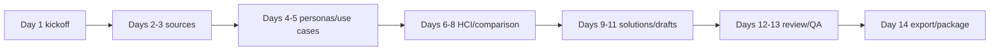

# GroupID-PA1 Weekly Report

## Sprint objective
The 14-day sprint objective is to produce a consistent PA1 package comparing Strava and Nike Run Club, including product research, potential solutions, peer-review preparation, and a weekly report with validated PDFs and zip packaging.

## Team roster
| Member | Role |
| --- | --- |
| Member1 | Coordinator/citation QA |
| Member2 | Persona and use-case lead |
| Member3 | HCI findings lead |
| Member4 | Solution design lead |
| Member5 | Report packaging and validation lead |

## Sprint planning record
| Meeting | Attendance | Decisions | Actions |
| --- | --- | --- | --- |
| Sprint planning | All placeholder members | Product pair locked as Strava and Nike Run Club; RUP artifacts mapped into Scrum sprint; source log and ID policy approved. | Member1 maintains data file; research leads collect official sources; QA lead verifies PDFs and zip. |

## 14-day sprint plan
| Day | Task | Owner | Reviewer | Hours | Dependency | Output | Done criteria |
| --- | --- | --- | --- | --- | --- | --- | --- |
| 1 | Kickoff and scope lock | Member1 | All | 3 | None | Product pair locked as Strava and Nike Run Club | Team agrees on IDs and citation policy |
| 2 | Official-source collection for Strava | Member2 | Member1 | 4 | Scope | Strava source log | At least 6 official sources |
| 3 | Official-source collection for Nike Run Club | Member3 | Member1 | 4 | Scope | Nike Run Club source log | At least 7 official or reputable sources |
| 4 | Personas for both products | Member2 | Member3 | 5 | Sources | 6 personas | Contexts include device, motion, lighting/noise |
| 5 | Use cases for both products | Member2 | Member4 | 5 | Personas | 10 use cases | Each includes alternate/error/feedback |
| 6 | Strava HCI findings | Member3 | Member4 | 5 | Use cases | 10 Strava findings | Each cites evidence |
| 7 | Nike Run Club HCI findings | Member3 | Member4 | 5 | Use cases | 10 Nike Run Club findings | Each cites evidence |
| 8 | Strava/Nike Run Club comparison | Member1 | Member5 | 4 | Findings | Comparison table | 12 dimensions covered |
| 9 | Drawback inventory | Member4 | Member2 | 4 | Findings | 10 drawbacks | IDs S-D and N-D only |
| 10 | Potential solution design | Member4 | Member3 | 6 | Drawbacks | 20 solutions | 2 solutions per drawback |
| 11 | Peer-review preparation | Member5 | Member1 | 4 | Drafts | 7-slide plan | 7-minute script and Q&A |
| 12 | Internal review and citation QA | Member1 | All | 5 | Drafts | QA notes | No unsupported claims |
| 13 | PDF generation and text validation | Member5 | Member1 | 4 | QA | Four PDFs | No restricted old product text |
| 14 | Final zip packaging | Member5 | Member1 | 2 | PDFs | GroupID-PA1.zip | Four PDFs at top level |

## Weekly scrum 1
| Member | Done | Next | Blocker |
| --- | --- | --- | --- |
| Member1 | Locked Strava and Nike Run Club scope; created citation policy. | Review source log and comparison dimensions. | Needs real group ID if available. |
| Member2 | Drafted Strava and Nike Run Club personas. | Complete use cases. | None. |
| Member3 | Collected Nike Run Club official app/help/newsroom sources. | Write HCI findings. | Some app-store wording is long and must be summarized. |
| Member4 | Started drawback taxonomy. | Map solutions to HCI concepts. | Waiting for final findings. |
| Member5 | Prepared report structure and packaging checklist. | Validate PDFs and zip. | Weekly template PDF not present locally. |

## Weekly scrum 2
| Member | Done | Next | Blocker |
| --- | --- | --- | --- |
| Member1 | Checked citations and product-name consistency. | Final source scan. | None. |
| Member2 | Completed 10 use cases with context and feedback. | Review peer questions. | None. |
| Member3 | Completed Strava and Nike Run Club HCI findings. | Support speaker notes. | None. |
| Member4 | Completed 20 solutions and priority table. | Help QA drawback mapping. | None. |
| Member5 | Generated PDFs and zip draft. | Run text extraction and zip listing. | None. |

## Hours matrix
| Member | Research | Writing | Review | Packaging | Total |
| --- | --- | --- | --- | --- | --- |
| Member1 | 4 | 5 | 5 | 1 | 15 |
| Member2 | 5 | 6 | 2 | 0 | 13 |
| Member3 | 6 | 5 | 2 | 0 | 13 |
| Member4 | 2 | 7 | 3 | 0 | 12 |
| Member5 | 1 | 4 | 3 | 5 | 13 |

## Sprint review
| Reviewed item | Result | Follow-up |
| --- | --- | --- |
| ProductResearch | Pass: Strava and Nike Run Club personas, use cases, HCI findings, drawbacks, comparison, diagrams, and references included. | Replace placeholder names if lecturer requires real names. |
| PotentialSolutions | Pass: every drawback maps to two solutions and HCI principles. | Prototype quick wins if PA2 asks for mockups. |
| PeerReview | Pass: 7-minute script, slide plan, questions, feedback, and revision log included. | Use real commenter names after live review. |
| WeeklyReport | Pass: RUP + Scrum structure, 14-day plan, scrums, hours matrix, and checklist included. | Use official course template if provided later. |

## Submission checklist
| Check | Status |
| --- | --- |
| Four PDFs generated | Pass |
| Zip contains four PDFs at top level | Pass |
| Source log created | Pass |
| No old product analysis in deliverables | Pass |
| Team roster appears | Pass |
| Sprint planning, two weekly scrums, sprint review appear | Pass |

## Risk and QA log
Risk 1: Product-pair inconsistency across reports. Mitigation: keep product names in the shared generator and regenerate all artifacts in one command.
Risk 2: Unsupported interface claims. Mitigation: every HCI finding uses official product, support, app-store, help, or newsroom citations and avoids invented screenshots.
Risk 3: Beginner analysis becoming generic. Mitigation: Nike Run Club use cases include trigger, context, preconditions, postconditions, normal flow, alternate flow, error path, and feedback.
Risk 4: Privacy and safety claims becoming vague. Mitigation: Strava privacy is tied to audience controls, while Nike Run Club safety is tied to live location sharing recipients, duration, and stop confirmation.
Risk 5: Generated output drifting from source files. Mitigation: the generator overwrites Markdown, JSON, PDFs, manifest, extracted text, and zip package in the same run.

## Definition of done
ProductResearch is done when it contains two products, six personas, ten use cases, twenty HCI findings, ten drawbacks, ten benefits, cross-product comparison, two diagrams, and references.
PotentialSolutions is done when every Strava and Nike Run Club drawback has two mapped solutions with UI behavior detail, HCI principle mapping, priority, effort, tradeoffs, and rollout placement.
PeerReview is done when the seven-slide plan, seven-minute script, likely Q&A, feedback table, and revision log all use Strava and Nike Run Club consistently.
WeeklyReport is done when the 14-day sprint plan, sprint planning record, two weekly scrums, sprint review, hours matrix, and submission checklist all match the corrected product pair.
Packaging is done when the zip contains exactly the four regenerated PDFs at top level and no source files.

## Daily evidence notes
Day 1 note: The team locked the corrected product pair and agreed that all IDs must use S-P, N-P, S-UC, N-UC, S-HCI, N-HCI, S-D, N-D, S-S, and N-S formats.
Day 2 note: Strava source collection focused on official product, support, route, privacy, segment, challenge, App Store, and Google Play sources.
Day 3 note: Nike Run Club source collection focused on official Nike product, App Store, Google Play, training plan, help, newsroom, and running-goals sources.
Day 4 note: Persona writing emphasized real running contexts rather than demographic-only profiles.
Day 5 note: Use-case writing required normal flow, alternate flow, error path, feedback, preconditions, and postconditions.
Day 6 note: Strava HCI findings were checked against record, route, privacy, segment, challenge, and activity-detail flows.
Day 7 note: Nike Run Club HCI findings were checked against free run, Guided Run, training plan, challenge, achievement, live sharing, metrics, and optional Apple Watch support.
Day 8 note: The comparison table was rewritten around sports scope, target users, recording flow, guidance style, social feedback, privacy and safety, metric density, motivation design, learnability, error tolerance, accessibility, and context fit.
Day 9 note: Drawbacks were normalized so ProductResearch and PotentialSolutions use the same S-D and N-D IDs.
Day 10 note: Solution design required two solutions per drawback and rejected ideas that lacked a concrete control or feedback behavior.
Day 11 note: Peer-review preparation balanced speaker timing across five placeholder members and kept the presentation to seven minutes.
Day 12 note: Citation QA checked that product claims are supported by numbered references and that no irrelevant source remains in deliverables.
Day 13 note: Output QA extracted PDF text, checked file sizes, scanned restricted terms, and inspected zip contents.
Day 14 note: The final package was created with exactly four PDFs at top level.

## Two-week sprint timeline

Text fallback: Day 1 kickoff -> Days 2-3 sources -> Days 4-5 personas/use cases -> Days 6-8 HCI/comparison -> Days 9-11 solutions/drafts -> Days 12-13 review/QA -> Day 14 export/package.

## References
[1] Strava | Running, Cycling & Hiking App. Official product page. https://www.strava.com/. Accessed 2026-06-10. Supports: Strava positions itself around activity tracking, maps, performance data, and community sharing.
[2] Recording an Activity - Strava Support. Official support. https://support.strava.com/hc/en-us/articles/216917397-Recording-an-Activity. Accessed 2026-06-10. Supports: Mobile recording includes activity capture, save/discard choices, activity details, privacy controls, and Beacon entry points.
[3] Activity Privacy Controls - Strava Support. Official support. https://support.strava.com/hc/en-us/articles/216919377-Activity-Privacy-Controls. Accessed 2026-06-10. Supports: Activities can use Everyone, Followers, or Only You visibility, with default and per-activity changes.
[4] Creating Routes on Mobile - Strava Support. Official support. https://support.strava.com/hc/en-us/articles/18001474720397-Creating-Routes-on-Mobile. Accessed 2026-06-10. Supports: The mobile Maps tab and Create Route flow support route planning by sport type and map interaction.
[5] Segment Leaderboard Guidelines - Strava Support. Official support. https://support.strava.com/hc/en-us/articles/216919507-Segment-Leaderboard-Guidelines. Accessed 2026-06-10. Supports: Segments use matched GPS efforts and leaderboards separated by activity type.
[6] Strava Challenges - Strava Support. Official support. https://support.strava.com/hc/en-us/articles/216919177-Strava-Challenges. Accessed 2026-06-10. Supports: Challenges motivate activity through distance, elevation, time, segment, and frequency goals.
[9] Nike Run Club App. Official product page. https://www.nike.com/nrc-app. Accessed 2026-06-10. Supports: Nike Run Club is a running app with guided runs, training plans, challenges, run tracking, and community motivation.
[10] Nike Run Club: Running Coach - App Store. Official app store. https://apps.apple.com/us/app/nike-run-club-running-coach/id387771637. Accessed 2026-06-10. Supports: The listing describes Guided Runs, Training Plans, Apple Watch support, challenges, achievements, and safety features.
[11] Nike Run Club - Running Coach - Google Play. Official app store. https://play.google.com/store/apps/details?id=com.nike.plusgps. Accessed 2026-06-10. Supports: The listing describes GPS run tracking, Audio-Guided Runs, Training Plans, challenges, and coaching.
[12] Running Training Plans. Nike.com. Official Nike page. https://www.nike.com/running/training-plans. Accessed 2026-06-10. Supports: Nike training plans include guided runs, mindset advice, recovery tips, and goal-oriented running schedules.
[13] Does the NRC App Have Training Plans? | Nike Help. Official Nike help. https://www.nike.com/help/a/nrc-plan. Accessed 2026-06-10. Supports: Nike states the app features training plans created by NRC coaches for all levels of runners.
[14] How Do I Get Started in the NRC App? | Nike Help. Official Nike help. https://www.nike.com/help/a/nrc-start-run. Accessed 2026-06-10. Supports: The Run tab supports basic runs, distance or time targets, speed runs, and Guided Runs.
[15] Nike Run Club App Delivers New Features. Official Nike newsroom. https://about.nike.com/en/newsroom/releases/nike-run-club-app-new-features. Accessed 2026-06-10. Supports: Nike describes localized run tips, real-time location sharing with friends and family, six training plans, and about 300 audio guided runs.
[16] How the Nike Run Club App Can Help You Reach Your Running Goals. Official Nike page. https://www.nike.com/a/running-goals. Accessed 2026-06-10. Supports: Nike describes pace, location, distance, elevation, heart rate, mile splits, progress history, and wearable pairing.
