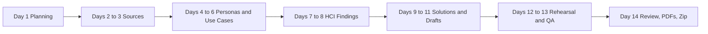

# GroupID-PA1 Weekly Report

## Sprint objective

Produce PA1 reports for FIFA.com and Chess.com with visual screenshot evidence and HCI analysis, then package four submission-ready PDFs in GroupID-PA1.zip.

## Real team roster

| Member | Student ID | Role | Main contribution |
| --- | --- | --- | --- |
| Le Minh | 21127645 | Project Coordinator, Integration Lead, PeerReview Lead, WeeklyReport Lead, Final Packaging Lead | Coordinated scope, integrated final reports, led PeerReview and WeeklyReport evidence, ran final PDF and zip packaging QA. |
| Nguyen Vu Bach | 21127224 | FIFA.com Research Lead, FIFA Screenshot Evidence Lead, ProductResearch Co-Lead | Researched FIFA.com, collected official sources, captured and annotated FIFA evidence, and wrote FIFA HCI findings. |
| Pham Nguyen Gia Bao | 20127119 | Chess.com Research Lead, Chess.com Screenshot Evidence Lead, ProductResearch Co-Lead | Researched Chess.com, collected official sources, captured and annotated Chess.com evidence, and wrote Chess.com HCI findings. |
| Trang Minh Nhut | 22127318 | HCI Analysis Lead, PotentialSolutions Lead, Visual QA Lead | Mapped HCI concepts, led PotentialSolutions, checked figure captions, and verified drawback-to-solution consistency. |

## Planned meeting schedule

| Meeting | Planned date | Attendance |
| --- | --- | --- |
| Sprint Planning | 2026-06-10 | All four members |
| Weekly Scrum 1 | 2026-06-14 | All four members |
| Weekly Scrum 2 | 2026-06-19 | All four members |
| Sprint Review and Retrospective | 2026-06-22 | All four members |

## Sprint planning meeting

| Field | Detail |
| --- | --- |
| Meeting type | Sprint Planning |
| Planned date | 2026-06-10 |
| Attendance | Le Minh, Nguyen Vu Bach, Pham Nguyen Gia Bao, Trang Minh Nhut |
| Decisions | Product pair locked as FIFA.com and Chess.com; final reports must include visual screenshot evidence; ProductResearch co-led by Nguyen Vu Bach and Pham Nguyen Gia Bao; PotentialSolutions led by Trang Minh Nhut; PeerReview, WeeklyReport, integration, and packaging led by Le Minh; screenshots must be annotated and referenced; four final PDFs must be packaged at the top level of GroupID-PA1.zip. |
| Task assignments | Le Minh: coordinate scope, manage final checklist, write PeerReview, support WeeklyReport, regenerate PDF and zip. Nguyen Vu Bach: research FIFA.com, collect FIFA sources, capture and annotate FIFA screenshots, write FIFA HCI findings. Pham Nguyen Gia Bao: research Chess.com, collect Chess.com sources, capture and annotate Chess screenshots, write Chess.com HCI findings. Trang Minh Nhut: map HCI concepts, write PotentialSolutions, check figure captions, check consistency between drawbacks and solutions. |
| Actions | Use official sources first; preserve F- and C-prefix IDs; regenerate PDFs from source after final fixes. |

## Weekly Scrum 1

Meeting type: Weekly Scrum 1. Planned date: 2026-06-14. Attendance: all four members.

| Member | Completed work | Next work | Issues or obstacles | Action needed |
| --- | --- | --- | --- | --- |
| Le Minh | Prepared report structure, reviewed PA1 checklist, organized deliverable folders, drafted PeerReview outline. | Integrate ProductResearch sections and prepare QA checklist. | Needs research sections from both product leads before integration. | Remind product leads to finish evidence tables and screenshot captions. |
| Nguyen Vu Bach | Collected FIFA.com official sources, captured FIFA.com screenshots, drafted FIFA personas and use cases. | Complete FIFA HCI findings and drawback list. | Some FIFA pages use dynamic content and require careful screenshot selection. | Use annotated screenshots and crop images for dense pages. |
| Pham Nguyen Gia Bao | Collected Chess.com official sources, captured Chess.com screenshots, drafted Chess.com personas and use cases. | Complete Chess.com HCI findings and drawback list. | Some game-board and review features may require account or accessible demo views. | Use available public screens and official support sources when interactive screens are limited. |
| Trang Minh Nhut | Prepared HCI concept mapping template, reviewed initial screenshots, created solution mapping structure. | Convert drawbacks into HCI-based solutions and check caption quality. | Needs final drawback list from both product leads. | Align drawback IDs with ProductResearch before writing PotentialSolutions. |

## Weekly Scrum 2

Meeting type: Weekly Scrum 2. Planned date: 2026-06-19. Attendance: all four members.

| Member | Completed work | Next work | Issues or obstacles | Action needed |
| --- | --- | --- | --- | --- |
| Le Minh | Integrated draft reports, reviewed PeerReview script, checked filenames and zip requirements. | Finalize WeeklyReport, regenerate PDFs, run final scan. | Must ensure no old product names or disallowed wording remain. | Run repo-wide text scan and PDF extraction scan. |
| Nguyen Vu Bach | Finished FIFA.com overview, personas, use cases, annotated figures, benefits, drawbacks, and HCI findings. | Review ProductResearch PDF after regeneration. | Some FIFA figures are visually dense. | Use crop figures and captions to make highlighted regions clearer. |
| Pham Nguyen Gia Bao | Finished Chess.com overview, personas, use cases, annotated figures, benefits, drawbacks, and HCI findings. | Review ProductResearch and PotentialSolutions after regeneration. | Chess.com has many features, so analysis can become too broad. | Keep analysis tied to play, puzzles, learn, review, and navigation tasks. |
| Trang Minh Nhut | Completed drawback-to-solution matrix, impact-effort table, rollout plan, and visual QA checks. | Review final screenshots, captions, and solution consistency. | Must ensure every solution maps to a real drawback. | Compare PotentialSolutions against ProductResearch before PDF export. |

## Sprint review

| Field | Detail |
| --- | --- |
| Meeting type | Sprint Review and Retrospective |
| Planned date | 2026-06-22 |
| Attendance | Le Minh, Nguyen Vu Bach, Pham Nguyen Gia Bao, Trang Minh Nhut |
| What went well | Product pair is consistent as FIFA.com and Chess.com. Visual evidence is strong, with raw screenshots, annotated screenshots, crop images, and figure captions. ProductResearch, PotentialSolutions, and PeerReview are mostly complete. Old products were removed from final deliverables. |
| What went wrong | WeeklyReport initially used generic member labels. Scrum records were initially summarized at meeting level. PeerReview owner fields initially used generic owner names. WorkDivision document required Vietnamese regeneration. |
| Causes | Team data was not centralized early enough. Generated reports reused default member labels. Final audit was performed after PDF generation, so some source problems remained in the generated PDFs. |
| What to improve | Keep real member data in a single source-of-truth file. Run text scans before PDF export. Review WeeklyReport separately because it has process-specific grading requirements. Validate generated PDF text, not only markdown sources. |
| Lessons learned | A strong visual report still fails strict readiness if team evidence and scrum details are incomplete. Per-member progress records are needed for WeeklyReport. Final packaging must be regenerated after any source fix. |

## Workload matrix

| Member | Role | Research | Writing | Review | Packaging | Total |
| --- | --- | --- | --- | --- | --- | --- |
| Le Minh | Coordinator/integration/PeerReview/WeeklyReport/packaging | 3 | 5 | 5 | 4 | 17 |
| Nguyen Vu Bach | FIFA.com research and visual evidence | 6 | 6 | 3 | 1 | 16 |
| Pham Nguyen Gia Bao | Chess.com research and visual evidence | 6 | 6 | 3 | 1 | 16 |
| Trang Minh Nhut | HCI analysis, PotentialSolutions, visual QA | 4 | 7 | 4 | 1 | 16 |

## Final submission checklist

| Deliverable | Expected filename | Acceptance status |
| --- | --- | --- |
| ProductResearch PDF | GroupID-PA1-ProductResearch.pdf | Contains FIFA.com and Chess.com evidence, figures, personas, use cases, HCI findings, references, and strict context labels. |
| PotentialSolutions PDF | GroupID-PA1-PotentialSolutions.pdf | Contains drawback-to-solution mapping, solution details, priority/effort rationale, rollout plan, and solution figures. |
| PeerReview PDF | GroupID-PA1-PeerReview.pdf | Contains seven-minute script, slide plan, internal rehearsal feedback, and real owner names. |
| WeeklyReport PDF | GroupID-PA1-WeeklyReport.pdf | Contains real roster, planned dates, sprint planning, two per-member scrum records, sprint review, workload matrix, and checklist. |
| Submission package | GroupID-PA1.zip | Contains exactly the four final PDFs at top level. |

## Diagram C. Sprint timeline

Figure W-01. Weekly sprint timeline and delivery sequence.

Text fallback: Planning first, research next, analysis after that, then solution writing, then QA and packaging.

## References
[1] Inside FIFA. Official FIFA news and navigation. https://inside.fifa.com/. Accessed 2026-06-10. Supports: Inside FIFA exposes Latest FIFA News and the global navigation labels Match Centre, News, Rankings, Tickets & Hospitality, Play, Inside FIFA, plus sibling destinations such as FIFA+, Store, Collect, and Rewards.
[2] All stories & topics. Official FIFA topic index. https://inside.fifa.com/all-stories. Accessed 2026-06-10. Supports: The all stories page supports exploratory browsing through categories, content types, articles, blogs, media releases, videos, and albums.
[3] FIFA World Cup 2026 Blog. Official FIFA tournament blog. https://inside.fifa.com/blogs/fwc-2026. Accessed 2026-06-10. Supports: The FIFA World Cup 2026 blog functions as a tournament story hub with dated updates and story cards.
[4] FIFA World Cup 26 Ticketing Programme launches this September. Official FIFA media release. https://inside.fifa.com/tournament-organisation/commercial/media-releases/world-cup-26-ticketing-programme-launch-september. Accessed 2026-06-10. Supports: FIFA directs fans to FIFA.com/tickets to register interest, create a FIFA ID, and follow phased ticket releases.
[5] FIFA World Cup 2026 Last-Minute Sales Phase. Official FIFA media release. https://inside.fifa.com/media-releases/last-minute-ticket-sales-phase-fifa-world-cup-2026. Accessed 2026-06-10. Supports: FIFA.com/tickets is identified as the official and preferred ticket source; fans are asked to check it regularly; the official Resale/Exchange Marketplace is available for eligible ticket holders.
[6] Watch FIFA+ Live Stream Online. Official FIFA+ watch destination. https://www.plus.fifa.com/. Accessed 2026-06-10. Supports: FIFA+ presents a watch surface with sign-in or get-started controls, live or upcoming content, highlights, replays, documentaries, and archive content. The FIFA+ destination is presented through a DAZN-branded page.
[7] Match Centre. Official FIFA Match Centre. https://www.fifa.com/en/match-centre. Accessed 2026-06-10. Supports: The Match Centre URL exposes fixtures, results, match details, competitions, and live-now filtering; some content is client-side rendered.
[8] FIFA/Coca-Cola Men's World Ranking. Official FIFA rankings page. https://inside.fifa.com/fifa-world-ranking/men. Accessed 2026-06-10. Supports: The rankings page exposes the latest men's ranking table, filters, official update dates, and ranking rules notes.
[9] Tickets & Hospitality. Official FIFA tickets page. https://www.fifa.com/en/tickets. Accessed 2026-06-10. Supports: The tickets URL is the official entry point for first-hand FIFA tournament ticket and hospitality information; the page is client-side rendered in crawled text.
[10] Chess.com homepage. Official Chess.com homepage. https://www.chess.com/. Accessed 2026-06-10. Supports: The homepage foregrounds Play, Puzzles, Learn, Train, Watch, Community, Get Started, lessons, bots, puzzles, and watching events.
[11] How do I start a game on Chess.com?. Official Chess.com help. https://support.chess.com/en/articles/8609779-how-do-i-start-a-game-on-chess-com. Accessed 2026-06-10. Supports: Users can start games from the homescreen or site-wide Play menu, using recent time control, custom settings, random opponent, bots, or friends.
[15] How does Game Review work?. Official Chess.com help. https://support.chess.com/en/articles/8584089-how-does-game-review-work. Accessed 2026-06-10. Supports: Game Review appears after a game and provides a detailed review flow with accuracy, move classifications, key moves, coach guidance, graphs, and retry learning.
[17] How do I use the analysis board?. Official Chess.com help. https://support.chess.com/en/articles/8583825-how-do-i-use-the-analysis-board. Accessed 2026-06-10. Supports: The Analysis Board supports direct manipulation, setup position, FEN/PGN loading, game history, collections, engine settings, evaluation bar, lines, arrows, and move feedback.
[18] How do Puzzles work on Chess.com?. Official Chess.com help. https://support.chess.com/en/articles/8608686-how-do-puzzles-work-on-chess-com. Accessed 2026-06-10. Supports: Puzzles are reachable from the side menu or homepage and include puzzle of the day, rated puzzles, themes, Puzzle Rush, and Puzzle Battle.
[19] How do Lessons work on Chess.com?. Official Chess.com help. https://support.chess.com/en/articles/8609703-how-do-lessons-work-on-chess-com. Accessed 2026-06-10. Supports: Lessons are reached from Learn, use interactive practice challenges, and include access limits by membership level.
[20] Chess Study Plans for All Levels. Official Chess.com article. https://www.chess.com/article/view/study-plan-directory. Accessed 2026-06-10. Supports: Study plans guide players by skill level and help organize training time through curated lessons and videos.
[21] Chess.com tournaments schedule. Official Chess.com help. https://support.chess.com/en/articles/9062345-chess-com-tournaments-schedule. Accessed 2026-06-10. Supports: Tournament schedules expose arena and prize tournament calendars such as Titled Tuesday, Arena Kings, Bullet Brawls, and variant events.
[22] Cheating And Fair Play On Chess.com. Official Chess.com fair-play page. https://www.chess.com/cheating. Accessed 2026-06-10. Supports: The fair-play page explains competitive integrity, account closures, fair-play policy, event checks, and enforcement expectations.
